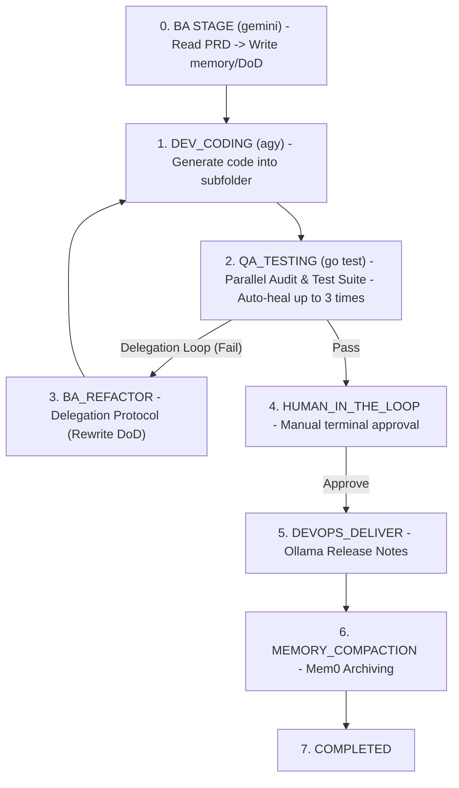

# Harness Orchestration Engine & Validation Modules (v2026.1)

Welcome to the **Harness Orchestration System**, a robust, state-aware automation pipeline and high-performance validation engine engineered for Go ecosystems. This project integrates autonomous AI agents, automated quality assurance workflows, and local LLM orchestration to streamline development from initial analysis through deployment delivery.

---

## 🚀 Key Features

### 1. 🔄 Multi-Stage Orchestration Pipeline (`internal/pipeline/`)



The orchestrator transitions autonomously through defined pipeline states (`internal/pipeline/stages.go`), persisting its current state to `workspace/state.json`. It features robust **Goroutine Concurrency** and **Mutex-protected Telemetry Tracking** to export runtime metrics to `workspace/telemetry.json`.
*   **`DEV_CODING`**: Invokes the configured developer agent (`agy` CLI by default) to synthesize and self-verify project files. In Epic mode, this can run concurrently across isolated workspaces.
*   **`QA_TESTING`**: Runs in parallel using goroutines:
    *   **Security Audit**: Strictly analyzes generated `.go` files for forbidden imports (like `os/exec`), destructive commands, or hardcoded credentials.
    *   **Test Suite**: Automatically executes the repository's test hooks (`go test -v ./workspace/...`). 
    If QA fails, combined errors are logged to `workspace/qa_error.log` for AI self-healing.
*   **`BA_REFACTOR` (Delegation Protocol)**: A dynamic non-linear delegation loop. If the Developer agent exhausts its QA healing retries, the orchestrator safely delegates back to the BA agent to rewrite and clarify the `definitions_of_done.md` based on the compilation errors.
*   **`HUMAN_IN_THE_LOOP`**: Halts the pipeline, requiring user approval via terminal (auto-approves after 30s) before integration.
*   **`DEVOPS_DELIVER`**: Calls a local Ollama instance to summarize the codebase changes and compile `workspace/RELEASE_NOTES.md`.
*   **`MEMORY_COMPACTION`**: Progressively analyzes requirements and archives architectural correlations directly into the local Mem0 vector database for semantic search.
*   **`COMPLETED`**: Finalizes the build, exports pipeline telemetry, and closes the loop.

### 2. 🛡️ Security & Validation Modules (`workspace/`)
A modular approach containing highly secure and robust validation components:
*   **Password Hashing**: Implements bcrypt hashing with strict constraints (72-byte limit, minimum cost factor of 10) to mitigate common vulnerabilities. Utilizes zero-allocation techniques (`unsafe.Slice`) for high-performance memory safety.
*   **Email Validation**: Comprehensive unit testing suite for validating email structures and edge cases.
*   **Landing Page**: A self-contained, modular package that serves a highly premium, glassmorphic marketing and technical landing page featuring interactive pipeline animations, and an asynchronous secure inquiry form with full server-side validation.

---

## ⚙️ Configuration & Agent Switching

You can switch the agents, models, and endpoints used in each phase dynamically using `harness_config.json` at the root of the project, or via CLI flags which override the defaults:

| Flag | Default Value | Description |
|---|---|---|
| `-task` | `""` | Raw requirement string. Triggers Phase 0 Business Analyst to update `definitions_of_done.md` |
| `-epic` | `""` | Path to a directory containing epic requirements. Triggers the Epic Orchestrator. |
| `-parallel-epic` | `false` | Run epic sub-tasks concurrently with isolated memory workspaces. |
| `-ba-agent` | `"gemini"` | Binary/CLI name used for Phase 0 Business Analyst |
| `-dev-agent` | `"agy"` | Binary/CLI name used for Phase 1 Developer Coding |
| `-dev-model` | `"gemini-2.5-flash"` | Model name for the Dev agent |
| `-devops-agent`| `"ollama"`| Binary/CLI name used for Phase 3 DevOps documentation |
| `-devops-model`| `"hermes3:8b"`| Model name to execute for Phase 3 DevOps documentation |

**Example usages:**
```bash
# Run with standard agents, triggering the BA phase with a raw task requirement
go run main.go -task "Create a secure bcrypt hashing module"

# Trigger the Epic Orchestrator to decompose and implement a large folder of requirements concurrently
go run main.go -epic "./requirements/auth_epic/" -parallel-epic

# Switch the dev coding agent to claude (if testing alternative models)
go run main.go -dev-agent claude -dev-model claude-sonnet-4-20250514
```

**Developer Agent Invocation:**
The Developer phase leverages the `agy` (or `claude`) CLI for autonomous execution, passing goals and granting restricted access via the DI `AgentSpec` pattern:
```bash
agy --print "$DEV_PROMPT" --dangerously-skip-permissions --add-dir ./workspace --add-dir ./memory
```

---

## 📁 Repository Structure

```
harness-app/
├── .agents/
│   └── antigravity_dev_prompt.md  # Autonomous Developer Agent configuration
├── internal/                      # Modular Harness Orchestrator core
│   ├── agent/                     # Pluggable CLI agent DI adapter
│   ├── config/                    # JSON Configuration loader
│   ├── memory/                    # System blueprint & AI compaction logic
│   ├── pipeline/                  # Core loops (epic, sequential, parallel)
│   ├── qa/                        # Concurrent security audit & test runner
│   └── telemetry/                 # Mutex-protected execution metrics
├── memory/
│   ├── definitions_of_done.md    # Product specifications & validation criteria
│   └── lessons_learned.md        # Debugging guidelines & operational history
├── mem0-server/                  # Local Mem0 vector database backend (submodule)
├── claude-tap/                   # Local AI agent trace viewer (submodule)
├── scripts/                      
│   ├── install_mem0.sh           # Setup script for Mem0
│   └── install_tap.sh            # Setup script for claude-tap trace viewer
├── workspace/                    # Core development artifacts
│   ├── email_validation/         # Modular package: Email Validation
│   ├── landing_page/             # Modular package: Landing Page
│   ├── password/                 # Modular package: Bcrypt Hashing
│   ├── random/                   # Modular package: Random Generation
│   └── state.json                # JSON active pipeline stage tracker
├── harness_config.json           # Agent and Model configurations
├── go.mod                        # Module definition (github.com/dothanhlam/harness-app)
├── main.go                       # Slim orchestrator entrypoint
└── README.md                     # Project documentation (this file)
```

---

## 🛠️ Getting Started & Usage

### Prerequisites
*   **Go** (1.26.1 or higher)
*   **Docker**: Required to run the local Mem0 vector database (`make memory-up`).
*   **Ollama**: Must be installed and running locally (`ollama serve`) with the configured model (e.g., `hermes3:8b`) to execute the automated DevOps documentation phase.
*   **agy CLI**: The Antigravity autonomous developer agent must be installed to execute code generation.

### First Time Setup
To setup and run the memory backend and trace viewer before executing the orchestrator:
```bash
./scripts/install_mem0.sh
./scripts/install_tap.sh
make memory-up
```

---

### Running the Test Suite
The project contains comprehensive unit tests that cover all modular implementations within the `workspace/` folder. Run them using:

```bash
go test -v ./workspace/...
```

**Example output:**
```text
=== RUN   TestHashPassword
--- PASS: TestHashPassword (0.26s)
=== RUN   TestIsValidEmail
--- PASS: TestIsValidEmail (0.00s)
=== RUN   TestHandler_Index
--- PASS: TestHandler_Index (0.00s)
...
PASS
ok  	github.com/dothanhlam/harness-app/workspace/password	2.734s
ok  	github.com/dothanhlam/harness-app/workspace/landing_page	0.968s
```
