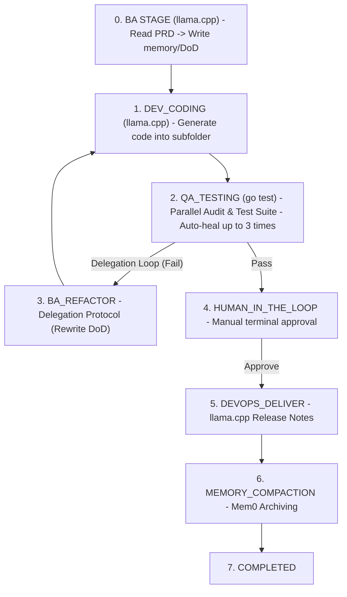

# Harness Orchestration Engine & Validation Modules (v2026.1)

Welcome to the **Harness Orchestration System**, a robust, state-aware automation pipeline and high-performance validation engine engineered for Go ecosystems. This project integrates autonomous AI agents, automated quality assurance workflows, and local LLM orchestration to streamline development from initial analysis through deployment delivery.

---

## 🚀 Key Features

### 1. 🔄 Multi-Stage Orchestration Pipeline (`internal/pipeline/`)


```mermaid
flowchart TD
    BA["0. BA STAGE (llama.cpp) - Read PRD -> Write memory/DoD"]
    DEV["1. DEV_CODING (llama.cpp) - Generate code into subfolder"]
    QA["2. QA_TESTING (go test) - Parallel Audit & Test Suite - Auto-heal up to 3 times"]
    BA_REF["3. BA_REFACTOR - Delegation Protocol (Rewrite DoD)"]
    HITL["4. HUMAN_IN_THE_LOOP - Manual terminal approval"]
    DEVOPS["5. DEVOPS_DELIVER - llama.cpp Release Notes"]
    COMPACT["6. MEMORY_COMPACTION - Mem0 Archiving"]
    DONE["7. COMPLETED"]

    BA --> DEV
    DEV --> QA
    QA -- "Delegation Loop (Fail)" --> BA_REF
    BA_REF --> DEV
    QA -- "Pass" --> HITL
    HITL -- "Approve" --> DEVOPS
    DEVOPS --> COMPACT
    COMPACT --> DONE
```

The orchestrator transitions autonomously through defined pipeline states (`internal/pipeline/stages.go`), persisting its current state to `workspace/state.json`. It features robust **Goroutine Concurrency** and **Mutex-protected Telemetry Tracking** to export runtime metrics to `workspace/telemetry.json`.
*   **`DEV_CODING`**: Invokes the configured developer agent (`agy` CLI by default) to synthesize and self-verify project files. The output target subfolder is dynamically determined by parsing the `# TASK:` or `- Target Subfolder:` tags generated in the `definitions_of_done.md`. If absent, it gracefully defaults to `workspace/default_task/`. In Epic mode, this runs concurrently across isolated workspaces.
*   **`QA_TESTING`**: Runs in parallel using goroutines:
    *   **Security Audit**: Strictly analyzes generated `.go` files for forbidden imports (like `os/exec`), destructive commands, or hardcoded credentials.
    *   **Test Suite**: Automatically executes the repository's test hooks (`go test -v ./workspace/...`). 
    If QA fails, combined errors are logged to `workspace/qa_error.log` for AI self-healing.
*   **`BA_REFACTOR` (Delegation Protocol)**: A dynamic non-linear delegation loop. If the Developer agent exhausts its QA healing retries, the orchestrator safely delegates back to the BA agent to rewrite and clarify the `definitions_of_done.md` based on the compilation errors.
*   **`HUMAN_IN_THE_LOOP`**: Halts the pipeline, requiring user approval via terminal (auto-approves after 30s) before integration.
*   **`DEVOPS_DELIVER`**: Calls a local llama.cpp instance to summarize the codebase changes and compile `workspace/RELEASE_NOTES.md`.
*   **`MEMORY_COMPACTION`**: Progressively analyzes requirements and archives architectural correlations directly into the local Mem0 vector database for semantic search.
*   **`COMPLETED`**: Finalizes the build, exports pipeline telemetry, and closes the loop.

### 2. 🛡️ Security & Validation Modules (`workspace/`)
A modular approach containing highly secure and robust validation components:
*   **Password Hashing**: Implements bcrypt hashing with strict constraints (72-byte limit, minimum cost factor of 10) to mitigate common vulnerabilities. Utilizes zero-allocation techniques (`unsafe.Slice`) for high-performance memory safety.
*   **Email Validation**: Comprehensive unit testing suite for validating email structures and edge cases.
*   **Landing Page**: A self-contained, modular package that serves a highly premium, glassmorphic marketing and technical landing page featuring interactive pipeline animations, and an asynchronous secure inquiry form with full server-side validation.

---

## ⚙️ Configuration & Agent Switching

You can switch the agents, models, and endpoints used in each phase dynamically using `harness_config.json` at the root of the project, or via CLI flags which override the defaults:

| Flag | Default Value | Description |
|---|---|---|
| `-task` | `""` | Raw requirement string. Triggers Phase 0 Business Analyst to update `definitions_of_done.md` |
| `-target` | `""` | Explicit target subfolder to output generated code (e.g. `workspace/custom_folder`) |
| `-epic` | `""` | Path to a directory containing epic requirements. Triggers the Epic Orchestrator. |
| `-parallel-epic` | `false` | Run epic sub-tasks concurrently with isolated memory workspaces. |
| `-ba-agent` | `"llama_cpp"` | Binary/CLI name used for Phase 0 Business Analyst |
| `-ba-model` | `"hf://NousResearch/Hermes-3-Llama-3.1-8B-GGUF:Q4_K_M"` | Model path for the Phase 0 Business Analyst agent |
| `-dev-agent` | `"llama_cpp"` | Binary/CLI name used for Phase 1 Developer Coding |
| `-dev-model` | `"hf://bartowski/Qwen2.5-Coder-14B-Instruct-GGUF:Q4_K_M"` | Model path for the Dev agent |
| `-devops-agent`| `"llama_cpp"`| Binary/CLI name used for Phase 3 DevOps documentation |
| `-devops-model`| `"hf://NousResearch/Hermes-3-Llama-3.1-8B-GGUF:Q4_K_M"`| Model path to execute for Phase 3 DevOps documentation |

**Example usages:**
```bash
# Run with standard agents, triggering the BA phase with a raw task requirement
go run main.go -task "Create a secure bcrypt hashing module"

# Force output to a specific subfolder instead of generating one dynamically
go run main.go -task "Create a secure bcrypt hashing module" -target "workspace/security"

# Trigger the Epic Orchestrator to decompose and implement a large folder of requirements concurrently
go run main.go -epic "./requirements/auth_epic/" -parallel-epic

# Switch the dev coding agent to claude (if testing alternative models)
go run main.go -dev-agent claude -dev-model claude-sonnet-4-20250514
```

**Engine Migration: Ollama to llama.cpp**
The system has migrated its core execution engine from Ollama to the native `llama.cpp` flat binary (`llama-cli`) for local LLM inference (while retaining HTTP fallback for Docker). This provides zero-overhead execution and enables direct low-level parameter tuning.

**Installing New Models for llama.cpp:**
llama.cpp natively supports downloading and caching models from the Hugging Face Hub using the `hf://` prefix. Models will be stored in `~/.cache/huggingface/hub`.
1. Update `harness_config.json` with the path to the new model using the format `hf://<repo>:<quant>`:
   ```json
   "dev": {
     "agent": "llama_cpp",
     "model_name": "hf://bartowski/Qwen2.5-Coder-14B-Instruct-GGUF:Q4_K_M"
   }
   ```

**Developer Agent Invocation (Local CLI):**
```bash
# Local (CLI subprocess via llama.cpp)
llama-cli -hf bartowski/Qwen2.5-Coder-14B-Instruct-GGUF:Q4_K_M -c 16384 --flash-attn -p "$DEV_PROMPT"
```

---

## 📁 Repository Structure

```
harness-engineering/
├── .agents/
│   └── antigravity_dev_prompt.md  # Autonomous Developer Agent configuration
├── internal/                      # Modular Harness Orchestrator core
│   ├── agent/                     # Pluggable CLI/HTTP agent adapter
│   ├── config/                    # JSON Configuration loader
│   ├── memory/                    # System blueprint & AI compaction logic
│   ├── pipeline/                  # Core loops (epic, sequential, parallel)
│   ├── qa/                        # Concurrent security audit & test runner
│   └── telemetry/                 # Mutex-protected execution metrics
├── memory/
│   ├── definitions_of_done.md    # Product specifications & validation criteria
│   └── lessons_learned.md        # Debugging guidelines & operational history
├── scripts/
│   └── docker-entrypoint.sh      # Docker entrypoint
├── workspace/                    # Core development artifacts
│   ├── email_validation/         # Modular package: Email Validation
│   ├── landing_page/             # Modular package: Landing Page
│   ├── password/                 # Modular package: Bcrypt Hashing
│   ├── random/                   # Modular package: Random Generation
│   └── state.json                # JSON active pipeline stage tracker
├── harness_config.json           # Agent and Model configurations
├── Dockerfile                    # Multi-stage Go build
├── docker-compose.yml            # Harness sidecar
├── go.mod                        # Module definition (github.com/dothanhlam/harness-engineering)
├── main.go                       # Slim orchestrator entrypoint
└── README.md                     # Project documentation (this file)
```

---

## 🛠️ Integration & Usage Guidelines

The Harness Engine is a standalone framework designed to integrate into **any project directory**, whether it's a fresh scaffolding or an existing repository.

### Method 1: Git Submodule (Recommended for Monorepos)

If you are managing a large project or monorepo, you can include the framework as a git submodule.

```bash
cd /path/to/my-project

# Add the framework as a submodule
git submodule add https://github.com/dothanhlam/harness-engineering.git .harness-framework

# Build the framework
cd .harness-framework
go build -o harness .
cd ..

# Initialize Harness in your project
./.harness-framework/harness init --project-dir .

# Run the pipeline on your project
./.harness-framework/harness run --project-dir . --task "Create a secure bcrypt hashing module"
```

### Method 2: Global Binary (Local Execution)

Clone the framework independently and run the binary globally.

```bash
# Clone and build globally
git clone https://github.com/dothanhlam/harness-engineering.git
cd harness-engineering
go build -o harness .
sudo mv harness /usr/local/bin/

# Navigate to your actual project
cd /path/to/my-project

# Initialize and run
harness init --project-dir .
harness run --project-dir . --task "Add a Subtract function to the existing math_utils module"
```

### Method 3: Docker (No Local Setup)

You can run the framework completely via Docker without installing Go or `llama.cpp`. The `--project-dir` will be mounted inside the container.

```bash
cd /path/to/my-project

# 1. Clone the framework to build the image (one-time setup)
git clone https://github.com/dothanhlam/harness-engineering.git .harness-framework
cd .harness-framework
docker build -t harness-pipeline .
cd ..

# 2. Initialize Harness in your project using Docker
docker run --rm \
  -v $(pwd):/app/project \
  harness-pipeline init --project-dir /app/project

# 3. Run the pipeline (Mount your local AI models cache)
docker run --rm \
  -v $(pwd):/app/project \
  -v ~/.cache/huggingface/hub:/root/.cache/huggingface/hub \
  harness-pipeline run --project-dir /app/project --task "Create a hello world Go program"
```

> **Note:** The pipeline dynamically detects the project's ecosystem (Go, Node.js `package.json`, Python `pytest.ini` or `requirements.txt`) to run the appropriate QA test commands!

---

### Step-by-Step Breakdown

**1. Project Initialization (`harness init`)**
When you run `init`, the framework scaffolds the following in your target directory:
- `.harness/rules.json`: Dynamic QA rules and security audit configurations (e.g., banning `rm -rf`).
- `.agents/`: Autonomous agent instructions and prompts (e.g., instructing the Dev agent to output `SEARCH/REPLACE` blocks).

**2. Running the Pipeline (`harness run`)**
When running on an existing project, the Developer Agent utilizes a Surgical File Editing technique (Aider-style `<<<< ==== >>>>` blocks). This ensures it safely patches existing code instead of blindly overwriting entire files.

---

---

### Running Tests on the Target Project

The Harness pipeline automatically executes tests during the `QA_TESTING` phase by dynamically detecting the target project's ecosystem (e.g., `npm run test` for Node.js, `pytest` for Python, `go test` for Go). 

To manually run the test suite on your target Go project after generation:

```bash
cd /path/to/my-project
go test -v ./...
```

**Example output:**
```text
=== RUN   TestHashPassword
--- PASS: TestHashPassword (0.26s)
=== RUN   TestIsValidEmail
--- PASS: TestIsValidEmail (0.00s)
...
PASS
ok  	github.com/my-org/my-project/password	2.734s
```
