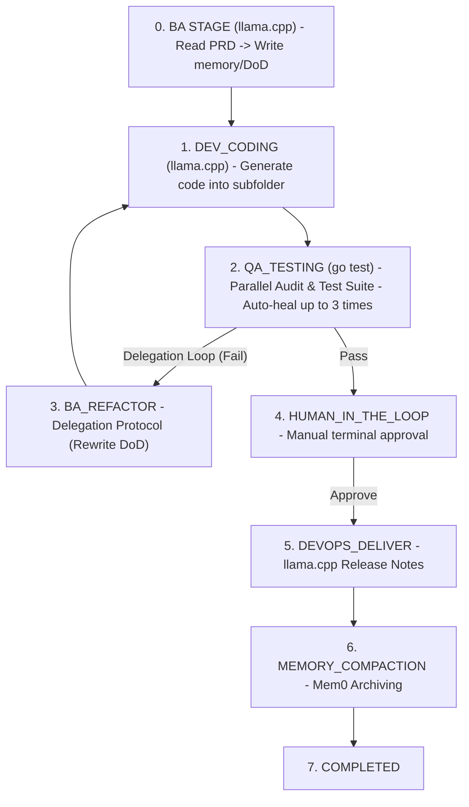

# Harness Orchestration Engine & Validation Modules (v2026.1)

Welcome to the **Harness Orchestration System**, a robust, state-aware automation pipeline and high-performance validation engine engineered for Go ecosystems. This project integrates autonomous AI agents, automated quality assurance workflows, and local LLM orchestration to streamline development from initial analysis through deployment delivery.

---

## 🚀 Key Features

### 1. 🔄 Multi-Stage Orchestration Pipeline (`internal/pipeline/`)


```mermaid
flowchart TD
    BA["0. BA STAGE (llama.cpp) - Read PRD -> Write memory/DoD"]
    DEV["1. DEV_CODING (llama.cpp) - Generate code into subfolder"]
    QA["2. QA_TESTING (go test) - Parallel Audit & Test Suite - Auto-heal up to 3 times"]
    BA_REF["3. BA_REFACTOR - Delegation Protocol (Rewrite DoD)"]
    HITL["4. HUMAN_IN_THE_LOOP - Manual terminal approval"]
    DEVOPS["5. DEVOPS_DELIVER - llama.cpp Release Notes"]
    COMPACT["6. MEMORY_COMPACTION - Mem0 Archiving"]
    DONE["7. COMPLETED"]

    BA --> DEV
    DEV --> QA
    QA -- "Delegation Loop (Fail)" --> BA_REF
    BA_REF --> DEV
    QA -- "Pass" --> HITL
    HITL -- "Approve" --> DEVOPS
    DEVOPS --> COMPACT
    COMPACT --> DONE
```

The orchestrator transitions autonomously through defined pipeline states (`internal/pipeline/stages.go`), persisting its current state to `workspace/state.json`. It features robust **Goroutine Concurrency** and **Mutex-protected Telemetry Tracking** to export runtime metrics to `workspace/telemetry.json`.
*   **`DEV_CODING`**: Invokes the configured developer agent (`agy` CLI by default) to synthesize and self-verify project files. The output target subfolder is dynamically determined by parsing the `# TASK:` or `- Target Subfolder:` tags generated in the `definitions_of_done.md`. If absent, it gracefully defaults to `workspace/default_task/`. In Epic mode, this runs concurrently across isolated workspaces.
*   **`QA_TESTING`**: Runs in parallel using goroutines:
    *   **Security Audit**: Strictly analyzes generated `.go` files for forbidden imports (like `os/exec`), destructive commands, or hardcoded credentials.
    *   **Test Suite**: Automatically executes the repository's test hooks (`go test -v ./workspace/...`). 
    If QA fails, combined errors are logged to `workspace/qa_error.log` for AI self-healing.
*   **`BA_REFACTOR` (Delegation Protocol)**: A dynamic non-linear delegation loop. If the Developer agent exhausts its QA healing retries, the orchestrator safely delegates back to the BA agent to rewrite and clarify the `definitions_of_done.md` based on the compilation errors.
*   **`HUMAN_IN_THE_LOOP`**: Halts the pipeline, requiring user approval via terminal (auto-approves after 30s) before integration.
*   **`DEVOPS_DELIVER`**: Calls a local llama.cpp instance to summarize the codebase changes and compile `workspace/RELEASE_NOTES.md`.
*   **`MEMORY_COMPACTION`**: Progressively analyzes requirements and archives architectural correlations directly into the local Mem0 vector database for semantic search.
*   **`COMPLETED`**: Finalizes the build, exports pipeline telemetry, and closes the loop.

### 2. 🛡️ Security & Validation Modules (`workspace/`)
A modular approach containing highly secure and robust validation components:
*   **Password Hashing**: Implements bcrypt hashing with strict constraints (72-byte limit, minimum cost factor of 10) to mitigate common vulnerabilities. Utilizes zero-allocation techniques (`unsafe.Slice`) for high-performance memory safety.
*   **Email Validation**: Comprehensive unit testing suite for validating email structures and edge cases.
*   **Landing Page**: A self-contained, modular package that serves a highly premium, glassmorphic marketing and technical landing page featuring interactive pipeline animations, and an asynchronous secure inquiry form with full server-side validation.

---

## ⚙️ Configuration & Agent Switching

You can switch the agents, models, and endpoints used in each phase dynamically using `harness_config.json` at the root of the project, or via CLI flags which override the defaults:

| Flag | Default Value | Description |
|---|---|---|
| `-task` | `""` | Raw requirement string. Triggers Phase 0 Business Analyst to update `definitions_of_done.md` |
| `-target` | `""` | Explicit target subfolder to output generated code (e.g. `workspace/custom_folder`) |
| `-epic` | `""` | Path to a directory containing epic requirements. Triggers the Epic Orchestrator. |
| `-parallel-epic` | `false` | Run epic sub-tasks concurrently with isolated memory workspaces. |
| `-ba-agent` | `"llama_cpp"` | Binary/CLI name used for Phase 0 Business Analyst |
| `-ba-model` | `"hf://NousResearch/Hermes-3-Llama-3.1-8B-GGUF:Q4_K_M"` | Model path for the Phase 0 Business Analyst agent |
| `-dev-agent` | `"llama_cpp"` | Binary/CLI name used for Phase 1 Developer Coding |
| `-dev-model` | `"hf://bartowski/Qwen2.5-Coder-14B-Instruct-GGUF:Q4_K_M"` | Model path for the Dev agent |
| `-devops-agent`| `"llama_cpp"`| Binary/CLI name used for Phase 3 DevOps documentation |
| `-devops-model`| `"hf://NousResearch/Hermes-3-Llama-3.1-8B-GGUF:Q4_K_M"`| Model path to execute for Phase 3 DevOps documentation |

**Example usages:**
```bash
# Run with standard agents, triggering the BA phase with a raw task requirement
go run main.go -task "Create a secure bcrypt hashing module"

# Force output to a specific subfolder instead of generating one dynamically
go run main.go -task "Create a secure bcrypt hashing module" -target "workspace/security"

# Trigger the Epic Orchestrator to decompose and implement a large folder of requirements concurrently
go run main.go -epic "./requirements/auth_epic/" -parallel-epic

# Switch the dev coding agent to claude (if testing alternative models)
go run main.go -dev-agent claude -dev-model claude-sonnet-4-20250514
```

**Engine Migration: Ollama to llama.cpp**
The system has migrated its core execution engine from Ollama to the native `llama.cpp` flat binary (`llama-cli`) for local LLM inference (while retaining HTTP fallback for Docker). This provides zero-overhead execution and enables direct low-level parameter tuning.

**Installing New Models for llama.cpp:**
llama.cpp natively supports downloading and caching models from the Hugging Face Hub using the `hf://` prefix. Models will be stored in `~/.cache/huggingface/hub`.
1. Update `harness_config.json` with the path to the new model using the format `hf://<repo>:<quant>`:
   ```json
   "dev": {
     "agent": "llama_cpp",
     "model_name": "hf://bartowski/Qwen2.5-Coder-14B-Instruct-GGUF:Q4_K_M"
   }
   ```

**Developer Agent Invocation (Local CLI):**
```bash
# Local (CLI subprocess via llama.cpp)
llama-cli -hf bartowski/Qwen2.5-Coder-14B-Instruct-GGUF:Q4_K_M -c 16384 --flash-attn -p "$DEV_PROMPT"
```

---

## 📁 Repository Structure

```
harness-app/
├── .agents/
│   └── antigravity_dev_prompt.md  # Autonomous Developer Agent configuration
├── internal/                      # Modular Harness Orchestrator core
│   ├── agent/                     # Pluggable CLI/HTTP agent adapter
│   ├── config/                    # JSON Configuration loader
│   ├── memory/                    # System blueprint & AI compaction logic
│   ├── pipeline/                  # Core loops (epic, sequential, parallel)
│   ├── qa/                        # Concurrent security audit & test runner
│   └── telemetry/                 # Mutex-protected execution metrics
├── memory/
│   ├── definitions_of_done.md    # Product specifications & validation criteria
│   └── lessons_learned.md        # Debugging guidelines & operational history
├── scripts/
│   └── docker-entrypoint.sh      # Docker entrypoint
├── workspace/                    # Core development artifacts
│   ├── email_validation/         # Modular package: Email Validation
│   ├── landing_page/             # Modular package: Landing Page
│   ├── password/                 # Modular package: Bcrypt Hashing
│   ├── random/                   # Modular package: Random Generation
│   └── state.json                # JSON active pipeline stage tracker
├── harness_config.json           # Agent and Model configurations
├── Dockerfile                    # Multi-stage Go build
├── docker-compose.yml            # Harness sidecar
├── go.mod                        # Module definition (github.com/dothanhlam/harness-app)
├── main.go                       # Slim orchestrator entrypoint
└── README.md                     # Project documentation (this file)
```

---

## 🛠️ Getting Started & Usage

### Prerequisites

| Requirement | Local Dev | Docker |
|---|:---:|:---:|
| **Go** 1.26.1+ | ✅ Required | ❌ Not needed |
| **llama.cpp** (running locally) | ✅ Required | ❌ Not needed |
| **Docker & Docker Compose** | ❌ Not needed | ✅ Required |

---

### Step 1: Sandbox Initialization & Skill Provisioning

Harness Engineering features an on-demand, interactive skill installer that allows you to provision expert domain skills from the `antigravity-awesome-skills` catalog into your local workspace (`./.agents/skills`).

First, initialize the mandatory sandbox directories (`workspace/`, `memory/`, `.agents/skills/`) and scaffold the baseline configuration if missing:
```bash
make init
```

Next, run the interactive installer to select and install the expert toolkits required for your development task:
```bash
make skills
```

This will open an interactive menu in your terminal:
```text
========================================================
      Harness Engineering — Expert Skill Installer      
========================================================
Choose which expert domain skills to provision:

  1) @clickhouse-expert         (cc-skill-clickhouse-io)
  2) @test-driven-development   (test-driven-development)
  3) @debugging-strategies       (debugging-strategies)
  4) @go-clean-architecture     (golang-pro + patterns)
  5) Install ALL available skills (Advanced/Full setup)
  6) List currently installed skills
  7) Remove a specific skill
  8) Exit / Cancel

========================================================
❓ Enter choices (comma-separated, e.g. 1,3 or 5): 
```

To manage your installed skills programmatically:
```bash
# List all currently installed skills in the workspace
make list-skills

# Remove a specific skill from the workspace
make remove-skill SKILL=<skill-folder-name>
```

---

### Option A: Run Locally

Requires Go and llama.cpp installed on your machine:

```bash
# 1. Models will be automatically managed and cached in ~/.cache/huggingface/hub
# using the hf:// prefix.

# 2. Build the binary
make build

# 3. Run with a task
./harness_bin --task "Create a secure bcrypt hashing module"

# 4. Run an epic concurrently
./harness_bin --epic "./requirements/auth_epic/" --parallel-epic
```

---

### Option B: Run with Docker (Recommended)

No local Go or llama.cpp installation needed — everything runs in containers.

#### Quick Start

```bash
# Build the Docker images
make docker-build

# Run a single task (models are auto-pulled on first run)
make docker-run TASK="Create a hello world Go program"

# Stop everything
make docker-down
```

#### Architecture

The Docker setup uses a **single-container architecture** that bundles the `llama.cpp` inference engine alongside the Go orchestrator.

```text
┌─────────────────────────────────────────────────────────────┐
│  Docker Container                                           │
│                                                             │
│  ┌──────────────────┐     Subprocess    ┌────────────────┐  │
│  │  harness-pipeline│ ──────────────►   │ llama-cli      │  │
│  │  (Go binary)     │                   │ (LLM Engine)   │  │
│  └────────┬─────────┘                   └────────┬───────┘  │
│           │                                      │          │
└───────────┼──────────────────────────────────────┼──────────┘
            │ bind mount                           │ bind mount
            ▼                                      ▼
   ./workspace/  (host)                   ~/ai_models (host)
   ./memory/     (host)                   (Model weights)
```

| Container | Image | Purpose |
|---|---|---|
| `harness-pipeline` | Built from `Dockerfile` | Runs the Go orchestrator and native `llama.cpp` execution engine |

#### 📂 Volume Mounts — Accessing Generated Code & Models

The `workspace/`, `memory/`, and your local model directory are **bind-mounted** from your host machine into the container. This means:

- **All code generated by the AI agents inside Docker appears instantly on your host filesystem.**
- You can open `./workspace/` in your IDE and watch files appear in real-time as the pipeline runs.
- **You MUST have your `.gguf` models downloaded to your host's `~/ai_models/` directory before running the container.**

```yaml
# From docker-compose.yml — these lines make it work:
volumes:
  - ./workspace:/app/workspace   # ← Generated code lives here on your host
  - ./memory:/app/memory         # ← Agent memory (DoD, blueprint) on your host
  - ./harness_config.json:/app/harness_config.json:ro  # ← Config (read-only)
  - ~/.cache/huggingface/hub:/root/.cache/huggingface/hub:ro # ← Hugging Face model cache mapped into container
```

> **Tip:** After a pipeline run, browse `./workspace/<task_name>/` on your host to see the generated Go packages, tests, and release notes. The folder name (`<task_name>`) is dynamically determined by the Business Analyst agent based on your raw requirement.

#### All Docker Commands

```bash
make docker-build   # Build the harness image
make docker-up      # Start stack in detached mode
make docker-run TASK="your requirement"  # Run a single task
make docker-down    # Stop and remove containers

# Useful docker compose commands
docker compose logs -f              # Follow all output
```

---

### Running the Test Suite

```bash
go test -v ./workspace/...
```

**Example output:**
```text
=== RUN   TestHashPassword
--- PASS: TestHashPassword (0.26s)
=== RUN   TestIsValidEmail
--- PASS: TestIsValidEmail (0.00s)
=== RUN   TestHandler_Index
--- PASS: TestHandler_Index (0.00s)
...
PASS
ok  	github.com/dothanhlam/harness-app/workspace/password	2.734s
ok  	github.com/dothanhlam/harness-app/workspace/landing_page	0.968s
```
