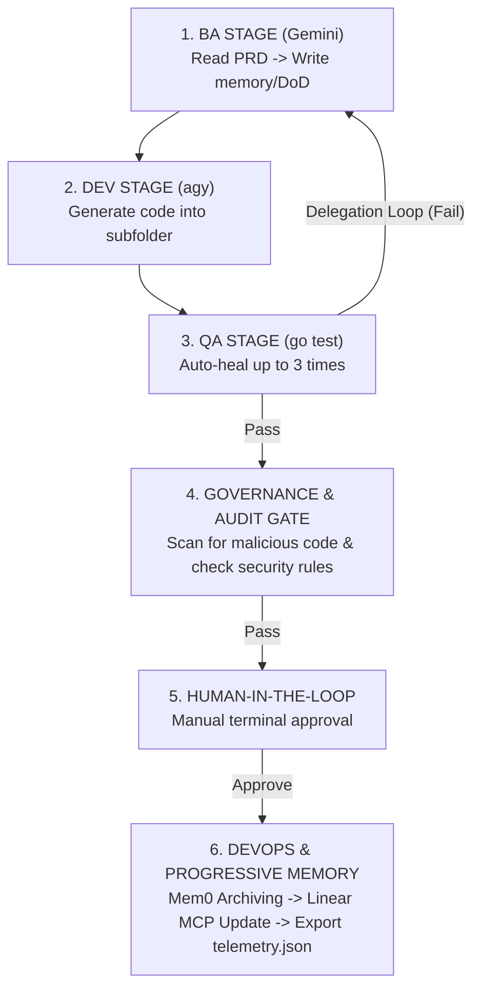

# Chapter 2: The Core Pipeline Architecture

At the heart of our repository is `main.go`. This is the orchestrator—the brain of the Harness System. It acts as the manager for our AI agents.

## The Multi-Stage Orchestration Pipeline

Our pipeline is broken down into 6 distinct stages. When you trigger the harness, it moves through these stages autonomously.

### Stage Breakdown

1. **BA STAGE (Gemini)**: The pipeline starts by taking a raw human requirement. By leveraging the **Model Context Protocol (MCP)**, the BA agent can even read external documents like a Notion PRD directly. It then writes a highly technical checklist called `definitions_of_done.md` (DoD).
2. **DEV STAGE (agy)**: The Developer agent reads the DoD and writes the actual Go code into the `workspace/` folder.
3. **QA STAGE (go test)**: The system automatically runs unit tests. If the AI's code fails to compile or fails the tests, the pipeline doesn't stop. It triggers a **Self-Healing Loop** where the AI is fed the error logs and asked to try again.
4. **GOVERNANCE & AUDIT GATE**: Even if the code works, is it safe? This gate strictly scans the generated code for malicious behavior before proceeding.
5. **HUMAN-IN-THE-LOOP (HITL)**: An engineer (you!) is prompted in the terminal. You review the code and type `y` to approve it for integration.
6. **DEVOPS & PROGRESSIVE MEMORY**: The system generates release notes, exports `telemetry.json`, and leverages **MCP tools** to automatically update ticket trackers (like Linear) so you don't have to manually update project boards. Mem0 archives architectural correlations seamlessly.
