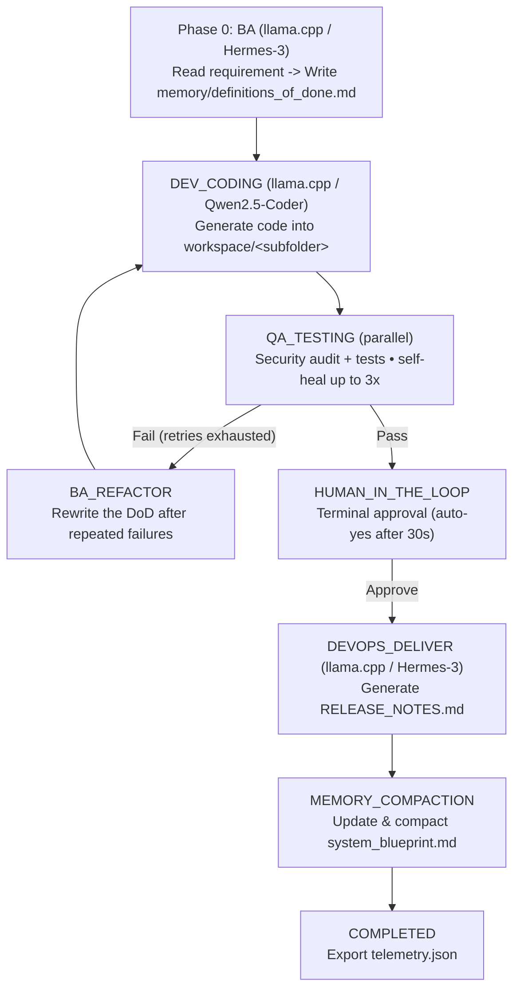

# Chapter 2: The Core Pipeline Architecture

At the heart of our repository is `main.go`, a slim entrypoint that hands off to the orchestrator packages under `internal/pipeline/`. Together they form the brain of the Harness System, acting as the manager for our AI agents.

## The Multi-Stage Orchestration Pipeline

The pipeline runs an initial **BA phase** followed by a state machine of tracked stages (defined in `internal/pipeline/stages.go`). When you trigger the harness, it moves through these stages autonomously, persisting the current stage to `workspace/state.json`.

```mermaid
flowchart TD
    BA["Phase 0: BA (llama.cpp / Hermes-3)<br>Read requirement -> Write memory/definitions_of_done.md"]
    DEV["DEV_CODING (llama.cpp / Qwen2.5-Coder)<br>Generate code into workspace/&lt;subfolder&gt;"]
    QA["QA_TESTING (parallel)<br>Security audit + tests • self-heal up to 3x"]
    BAREF["BA_REFACTOR<br>Rewrite the DoD after repeated failures"]
    HITL["HUMAN_IN_THE_LOOP<br>Terminal approval (auto-yes after 30s)"]
    DEVOPS["DEVOPS_DELIVER (llama.cpp / Hermes-3)<br>Generate RELEASE_NOTES.md"]
    COMPACT["MEMORY_COMPACTION<br>Update & compact system_blueprint.md"]
    DONE["COMPLETED<br>Export telemetry.json"]

    BA --> DEV
    DEV --> QA
    QA -- "Fail (retries exhausted)" --> BAREF
    BAREF --> DEV
    QA -- "Pass" --> HITL
    HITL -- "Approve" --> DEVOPS
    DEVOPS --> COMPACT
    COMPACT --> DONE
```

### Stage Breakdown

1. **BA Phase (Business Analyst)**: The pipeline starts by taking a raw human requirement (the `-task` flag). The BA agent turns it into a highly technical checklist called `definitions_of_done.md` (DoD), including the target subfolder for the generated code. By default this runs on a local **llama.cpp** model (Hermes-3-Llama-3.1-8B).
2. **DEV_CODING**: The Developer agent reads the DoD and writes the actual Go code into the target `workspace/<subfolder>`. By default this runs on a local **llama.cpp** model (Qwen2.5-Coder-14B). In Epic mode this runs concurrently across isolated workspaces.
3. **QA_TESTING**: The system runs a strict **security audit** and the project's **test suite** concurrently via goroutines. If the code fails to compile, fails the tests, or contains forbidden patterns, it triggers a **Self-Healing Loop** — the agent is fed the error logs from `workspace/qa_error.log` and retries (up to `MaxRetries = 3`).
4. **BA_REFACTOR (Delegation Protocol)**: If the Developer agent exhausts its healing retries, the Harness delegates the failure *back up the chain* to the BA agent, which rewrites the `definitions_of_done.md` to clear up ambiguity before looping back to `DEV_CODING`.
5. **HUMAN_IN_THE_LOOP (HITL)**: An engineer (you!) is prompted in the terminal. You review the code and type `y` to approve it for integration (it auto-approves after 30 seconds).
6. **DEVOPS_DELIVER**: A local llama.cpp model summarizes the changes and writes `workspace/RELEASE_NOTES.md`.
7. **MEMORY_COMPACTION**: The DevOps agent updates and compacts `memory/system_blueprint.md` so the AI's architectural memory stays coherent across runs without growing unbounded.
8. **COMPLETED**: Finalizes the run and exports `telemetry.json`.

> **Swappable agents.** Every phase's agent and model is configured in `harness_config.json` (or overridden with CLI flags). The defaults are fully local llama.cpp models, but you can swap in a CLI agent such as Claude — the repo ships an inactive `_dev_claude_backup` config block showing exactly how.
