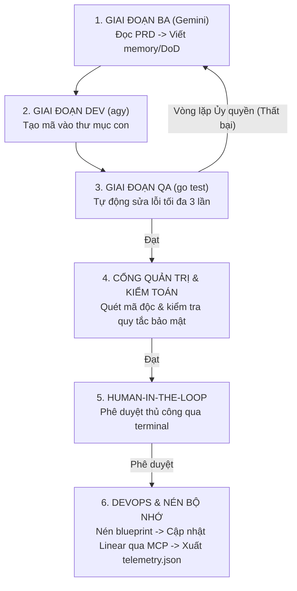

# Chương 2: Kiến trúc Đường ống Cốt lõi

Trái tim của repository của chúng ta là `main.go`. Đây là bộ điều phối — bộ não của Hệ thống Harness. Nó đóng vai trò là người quản lý cho các đặc vụ AI của chúng ta.

## Đường ống Điều phối Đa Giai đoạn

Đường ống của chúng ta được chia thành 6 giai đoạn riêng biệt. Khi bạn kích hoạt harness, nó sẽ tự động di chuyển qua các giai đoạn này.

### Chi tiết các Giai đoạn

1. **GIAI ĐOẠN BA (Gemini)**: Đường ống bắt đầu bằng việc nhận một yêu cầu thô từ con người. Bằng cách tận dụng **Model Context Protocol (MCP)**, đặc vụ BA thậm chí có thể đọc trực tiếp các tài liệu bên ngoài như Notion PRD. Sau đó, nó viết một danh sách kiểm tra kỹ thuật rất khắt khe gọi là `definitions_of_done.md` (DoD).
2. **GIAI ĐOẠN DEV (agy)**: Đặc vụ Lập trình viên đọc DoD và viết mã Go thực tế vào thư mục `workspace/`.
3. **GIAI ĐOẠN QA (go test)**: Hệ thống tự động chạy các unit test. Nếu mã của AI không thể biên dịch hoặc không vượt qua bài kiểm tra, đường ống sẽ không dừng lại. Nó kích hoạt một **Vòng lặp Tự sửa lỗi (Self-Healing Loop)** nơi AI được cung cấp các bản ghi lỗi và được yêu cầu thử lại.
4. **CỔNG QUẢN TRỊ & KIỂM TOÁN**: Ngay cả khi mã hoạt động, nó có an toàn không? Cổng này quét mã được tạo ra để tìm kiếm các hành vi độc hại một cách nghiêm ngặt trước khi tiếp tục.
5. **HUMAN-IN-THE-LOOP (HITL)**: Một kỹ sư (chính là bạn!) sẽ nhận được thông báo trên terminal. Bạn xem xét mã và gõ `y` để phê duyệt việc tích hợp nó.
6. **DEVOPS & NÉN BỘ NHỚ**: Hệ thống tạo ra các ghi chú phát hành (release notes), xuất file `telemetry.json`, và tận dụng **các công cụ MCP** để tự động cập nhật hệ thống theo dõi công việc (như Linear) để bạn không phải cập nhật các bảng dự án một cách thủ công.
