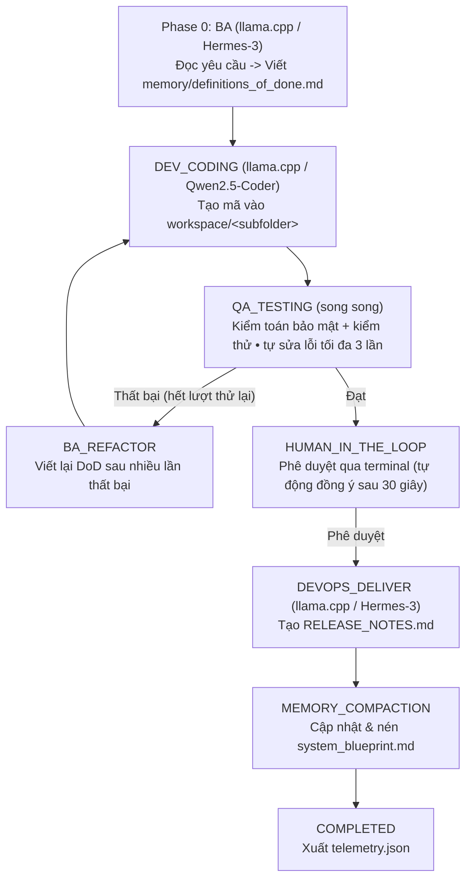

# Chương 2: Kiến trúc Pipeline Cốt lõi

Trái tim của repository của chúng ta là `main.go`, một điểm khởi đầu (entrypoint) gọn nhẹ, trao quyền xử lý cho các gói bộ điều phối (orchestrator) nằm trong `internal/pipeline/`. Cùng nhau, chúng tạo thành bộ não của Hệ thống Harness, đóng vai trò là người quản lý cho các AI agent của chúng ta.

## Pipeline Điều phối Đa Giai đoạn

Pipeline chạy một **giai đoạn BA** ban đầu, theo sau là một cỗ máy trạng thái (state machine) gồm các giai đoạn được theo dõi (định nghĩa trong `internal/pipeline/stages.go`). Khi bạn kích hoạt harness, nó sẽ tự động di chuyển qua các giai đoạn này, lưu giữ giai đoạn hiện tại vào `workspace/state.json`.

```mermaid
flowchart TD
    BA["Phase 0: BA (llama.cpp / Hermes-3)<br>Đọc yêu cầu -> Viết memory/definitions_of_done.md"]
    DEV["DEV_CODING (llama.cpp / Qwen2.5-Coder)<br>Tạo mã vào workspace/&lt;subfolder&gt;"]
    QA["QA_TESTING (song song)<br>Kiểm toán bảo mật + kiểm thử • tự sửa lỗi tối đa 3 lần"]
    BAREF["BA_REFACTOR<br>Viết lại DoD sau nhiều lần thất bại"]
    HITL["HUMAN_IN_THE_LOOP<br>Phê duyệt qua terminal (tự động đồng ý sau 30 giây)"]
    DEVOPS["DEVOPS_DELIVER (llama.cpp / Hermes-3)<br>Tạo RELEASE_NOTES.md"]
    COMPACT["MEMORY_COMPACTION<br>Cập nhật & nén system_blueprint.md"]
    DONE["COMPLETED<br>Xuất telemetry.json"]

    BA --> DEV
    DEV --> QA
    QA -- "Thất bại (hết lượt thử lại)" --> BAREF
    BAREF --> DEV
    QA -- "Đạt" --> HITL
    HITL -- "Phê duyệt" --> DEVOPS
    DEVOPS --> COMPACT
    COMPACT --> DONE
```

### Chi tiết các Giai đoạn

1. **Giai đoạn BA (Business Analyst)**: Pipeline bắt đầu bằng việc nhận một yêu cầu thô từ con người (cờ `-task`). BA agent biến nó thành một danh sách kiểm tra kỹ thuật rất khắt khe gọi là `definitions_of_done.md` (DoD), bao gồm cả thư mục con đích cho mã được tạo ra. Mặc định, giai đoạn này chạy trên một model **llama.cpp** cục bộ (Hermes-3-Llama-3.1-8B).
2. **DEV_CODING**: Developer agent đọc DoD và viết mã Go thực tế vào thư mục đích `workspace/<subfolder>`. Mặc định, giai đoạn này chạy trên một model **llama.cpp** cục bộ (Qwen2.5-Coder-14B). Ở chế độ Epic, giai đoạn này chạy đồng thời trên các workspace cô lập.
3. **QA_TESTING**: Hệ thống chạy một **kiểm toán bảo mật** nghiêm ngặt và **bộ kiểm thử** của dự án một cách đồng thời thông qua các goroutine. Nếu mã không thể biên dịch, không vượt qua các bài kiểm thử, hoặc chứa các mẫu bị cấm, nó sẽ kích hoạt một **Vòng lặp Tự sửa lỗi (Self-Healing Loop)** — agent được cung cấp các bản ghi lỗi từ `workspace/qa_error.log` và thử lại (tối đa `MaxRetries = 3`).
4. **BA_REFACTOR (Giao thức Ủy quyền)**: Nếu Developer agent dùng hết số lượt tự sửa lỗi, Harness sẽ ủy quyền sự thất bại đó *ngược lại lên trên* cho BA agent, agent này sẽ viết lại `definitions_of_done.md` để làm rõ các điểm mơ hồ trước khi lặp lại về `DEV_CODING`.
5. **HUMAN_IN_THE_LOOP (HITL)**: Một kỹ sư (chính là bạn!) sẽ nhận được thông báo trên terminal. Bạn xem xét mã và gõ `y` để phê duyệt việc tích hợp nó (nó tự động phê duyệt sau 30 giây).
6. **DEVOPS_DELIVER**: Một model llama.cpp cục bộ tóm tắt các thay đổi và viết `workspace/RELEASE_NOTES.md`.
7. **MEMORY_COMPACTION**: DevOps agent cập nhật và nén `memory/system_blueprint.md` để bộ nhớ kiến trúc của AI luôn mạch lạc qua các lần chạy mà không phình to vô hạn.
8. **COMPLETED**: Hoàn tất lần chạy và xuất `telemetry.json`.

> **Các agent có thể hoán đổi.** Agent và model của mỗi giai đoạn được cấu hình trong `harness_config.json` (hoặc ghi đè bằng các cờ CLI). Mặc định là các model llama.cpp hoàn toàn cục bộ, nhưng bạn có thể hoán đổi vào một CLI agent như Claude — repo đi kèm một khối cấu hình `_dev_claude_backup` không hoạt động, cho thấy chính xác cách làm.
