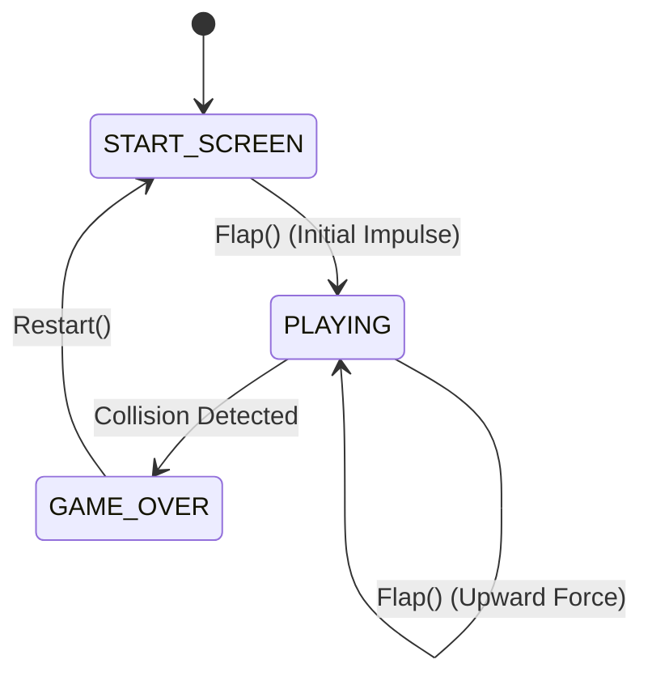

# Flappy Bird Game Engine (Harness Cyber-Flap)

A thread-safe, high-performance, and modular Go implementation of the Flappy Bird game engine coupled with a premium, low-latency, responsive synthwave/cyberpunk HTML5 Canvas web client. It compiles under Go 1.25+ and integrates seamlessly as a modular package.

## Technical Architecture Overview

The engine is modeled using a Finite State Machine (FSM) representing the different phases of the game. It uses deterministic Euler integration for physics simulation, Axis-Aligned Bounding Box (AABB) collision detection, and is completely thread-safe via read-write mutex locks (`sync.RWMutex`).



### Core Components
1. **FSM State Management:** Handled via states `StateStartScreen`, `StatePlaying`, and `StateGameOver`.
2. **Physics Engine:** Simulates gravity (`800.0 px/s²`) and discrete upward impulse (`-250.0 px/s`) on flaps. Horizontal speed is constant (`120.0 px/s`).
3. **Collision Detection:** Axes-Aligned Bounding Box (AABB) checks for upper and lower pipe hitboxes, ceiling (`Y = 0.0`), and ground (`Y = 560.0`).
4. **Procedural Generator:** Automatically spawns pipe pairs at configurable intervals, with randomized vertical gap center coordinates within strict safety limits.
5. **Persistence Layer:** Exposes the `HighScoreStore` interface allowing pluggable storage backends (e.g. in-memory or files) for local high score persistence.
6. **Audio Pipeline:** Emits reactive audio event triggers for flap, score point, pipe/ground hit, and game over.
7. **Premium Web Client:** Includes a responsive synthwave grid layout, multi-layered parallax stars background, dynamic particles engine, and a synthetic sound generator (via Web Audio API) with no external asset dependency.

## Installation

To import this module in your Go project:

```go
import "github.com/dothanhlam/harness-app/workspace/flappybird"
```

## Control Mapping (Inputs)

The engine receives inputs through standard method calls:
*   `Flap()` - Applies a jump impulse upward or starts the game if in start screen.
*   `Restart()` - Reinitializes all physics variables and sets state back to Start Screen.
*   `Update(dt)` - Advances the physics timeline by a delta time slice (dt in seconds).

For the web interface:
*   Press **SPACEBAR** or **MOUSEDOWN / TOUCH** anywhere on the canvas to flap.
*   Toggle sound settings using the **Synthetic SFX Engine** switch on the Game Over screen.

## Execution Guide

### 1. Zero-Config HTML Execution
You can run the web-based game client directly without running a server:
```bash
open workspace/flappybird/static/index.html
```

### 2. Go HTTP Server Execution
Start a local HTTP server using the built-in Go handler:
```go
package main

import (
	"fmt"
	"net/http"

	"github.com/dothanhlam/harness-app/workspace/flappybird"
)

func main() {
	handler := flappybird.Handler()
	fmt.Println("🚀 Cyber-Flap server running on http://localhost:8080")
	if err := http.ListenAndServe(":8080", handler); err != nil {
		panic(err)
	}
}
```

Then compile and run:
```bash
go run main.go
```
And navigate to `http://localhost:8080` in your web browser.
